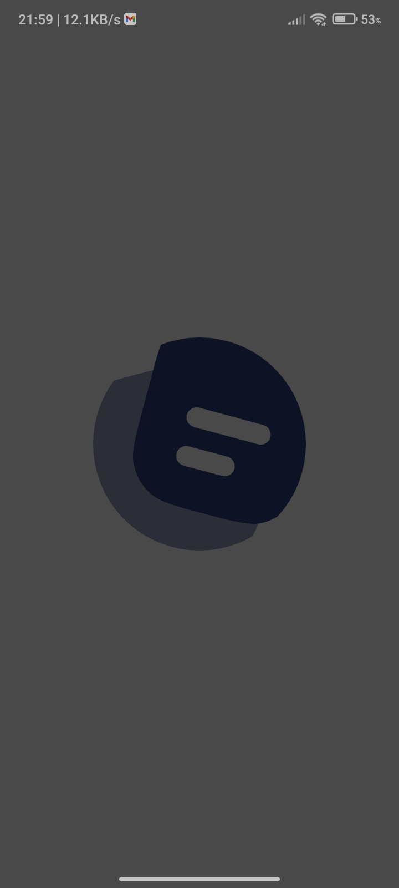
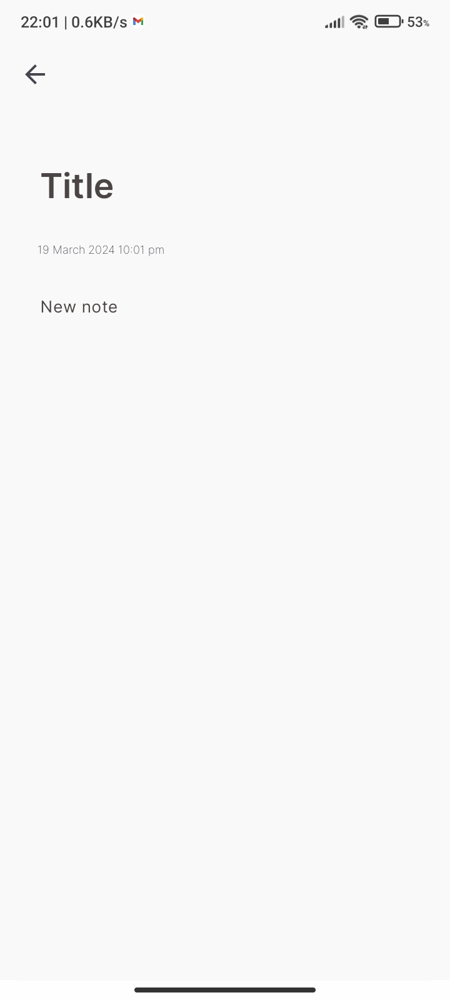
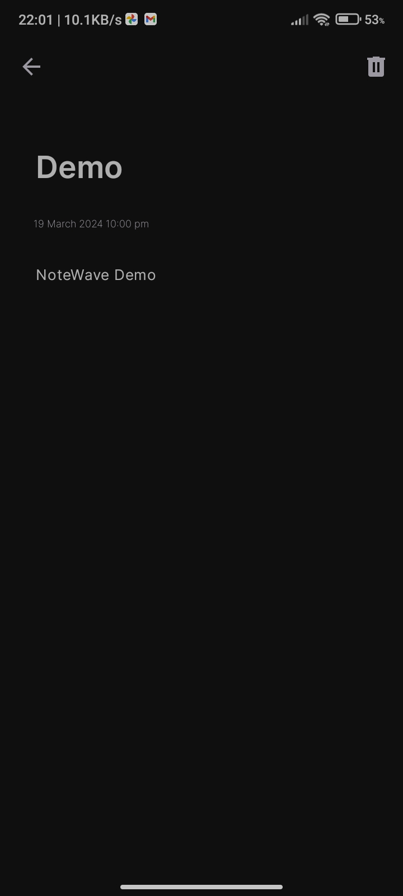
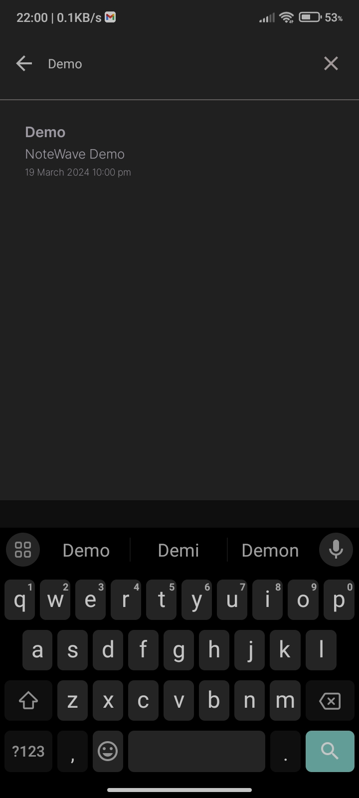

# NoteWave

NoteWave is a simple and intuitive note-taking Android application designed to help users capture and organize their thoughts, ideas, and tasks on the go. With a clean and user-friendly interface, NoteWave provides a seamless experience for users to jot down notes effortlessly.

## Features

- **Create and Edit Notes:** Easily create new notes or edit existing ones with the built-in editor.
- **Search Functionality:** Quickly find specific notes using the search feature.

## Nuts and Bolts
- Android Architecture Componets
    - Room Persistence Library
    - ViewModel
    - LiveData
    - View binding
    - Lifecycles
- Model View ViewModel Architecture pattern
- Repository pattern
- Navigation Component
- Material Design Components
- Kotlin Coroutines
- Kotlin Flow

## Screenshots
<p allign="center">




</p>


## Getting Started

To get started with NoteWave, follow these steps:

1. Download the repository to your local machine.

 ```Bash
 git clone git@github.com:slowburn-404/NoteWave.git
 ```

2. Build and run the app in Android Studio.


